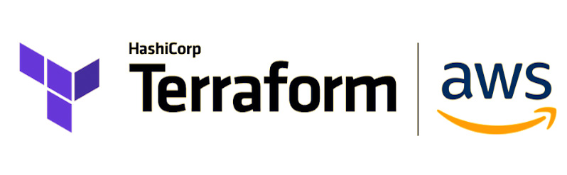

### For Detailed Explanation Check my Article on <a href = "https://link.medium.com/a6MuSdifr7">Medium<a/> 
  Click/Copy this link if above link doesn't work https://link.medium.com/a6MuSdifr7 
# One-Click-Launch-Infrastructure-Terraform-AWS

# Launch complete infrastructure on AWS using Terraform with just one click
Launch of Instance and other services like EBS, S3 and many more with just one click and the bonus is, we’ll be able to delete the complete infrastructure with just one click too. Isn’t it amazing?

## What is Terraform?
Terraform is a tool for building, changing, and versioning infrastructure safely and efficiently. Terraform can manage existing and popular service providers as well as custom in-house solutions.

## Configuration File — Terraform
The set of files used to describe infrastructure in Terraform is known as a Terraform configuration. You’ll write your first configuration now to launch a single AWS EC2 instance.

## AWS Security Group — Terraform
Provides a security group resource.
Terraform currently provides both a standalone Security Group Rule resource (a single ingress or egress rule), and a Security Group resource with ingress and egress rules defined in-line.

## AWS Instance — Terraform
Provides an EC2 instance resource. This allows instances to be created, updated, and deleted. Instances also support provisioning.

## AWS EBS Volume — Terraform
Manages a single EBS volume.
Note: One of size or snapshot_id is required when specifying an EBS volume

## AWS Volume Attachment — Terrfaform
Provides an AWS EBS Volume Attachment as a top level resource, to attach and detach volumes from AWS Instances.
 
If you use ebs_block_device on an aws_instance, Terraform will assume management over the full set of non-root EBS block devices for the instance, and treats additional block devices as drift. For this reason, ebs_block_device cannot be mixed with external aws_ebs_volume + aws_ebs_volume_attachment resources for a given instance.

## Null Resource — Terraform
The null_resource resource implements the standard resource life cycle but takes no further action.
The triggers argument allows specifying an arbitrary set of values that, when changed, will cause the resource to be replaced.
The primary use-case for the null resource is as a do-nothing container for arbitrary actions taken by a provisioner.

## AWS S3 Bucket & Object — Terraform
Provides a S3 bucket resource.

## AWS CloudFront distribution — Terraform
Creates an Amazon CloudFront web distribution.
CloudFront distributions take about 15 minutes to a deployed state after creation or modification. During this time, deletes to resources will be blocked. If you need to delete a distribution that is enabled and you do not want to wait, you need to use the retain_on_delete flag.

### Amazon Web Services (AWS) is the world’s most comprehensive and broadly adopted cloud platform, offering over 175 fully featured services from data centers globally. Millions of customers — including the fastest-growing startups, largest enterprises, and leading government agencies — are using AWS to lower costs, become more agile, and innovate faster.
